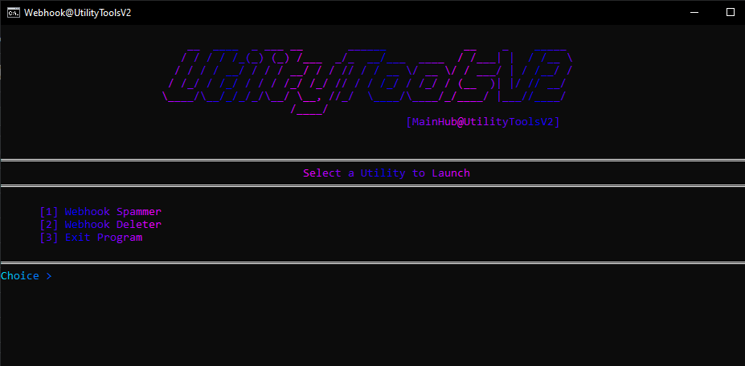

<p align="center">
  
</p>

<h1 align="center">UtilityToolsV2</h1>
<p align="center">
  <b>High-performance Discord Webhook management & Spammer/b><br>
  <i>Spam · Delete · Proxy Support · Multi-threaded efficiency</i>
</p>

<p align="center">
  <a href="#features">Features</a> •
  <a href="#quick-start">Quick Start</a> •
  <a href="#proxy-system">Proxy System</a> •
  <a href="#modules">Modules</a>
</p>

---

## ⚡ Features

- **Multi-Threaded Spammer** - High-speed delivery with adjustable thread counts (1-6)
- **Instant Webhook Deleter** - One-click permanent removal of Discord webhooks
- **Advanced Proxy Support** - Integrated support for HTTP, SOCKS5, and Cloudflare Forwarders
- **Smart Rate Limiting** - Built-in delay handling to optimize delivery without getting blocked
- **Centralized Hub** - Single `main.py` interface to switch between all utility modules

## 🚀 Quick Start

```bash
# 1. Download and extract the repository
# 2. Run run.bat to install requirements (pystyle, requests, etc.)
# 3. Add your proxies to data/proxies.txt (if using proxy mode)
# 4. Launch main.py to start the hub
```
<p align="center">
<i>Developed for educational purposes and authorized stress testing only.</i>
</p>


## 🛠 Modules

- **Webhook Spammer**: Customize message content, total message count, and delay intervals
- **Webhook Deleter**: Irreversible deletion of webhooks with a built-in confirmation safety check
- **Main Hub**: A unified CLI with a gradient ASCII interface for seamless navigation

## 🌐 Proxy System

The tool supports three distinct methods to bypass Discord rate limits:

- **Forwarders**: Routes traffic through Cloudflare Workers or Vercel instances
- **HTTP/S**: Standard proxy support for rotating or static IP lists
- **SOCKS5**: Optimized for high-anonymity and stable connections
